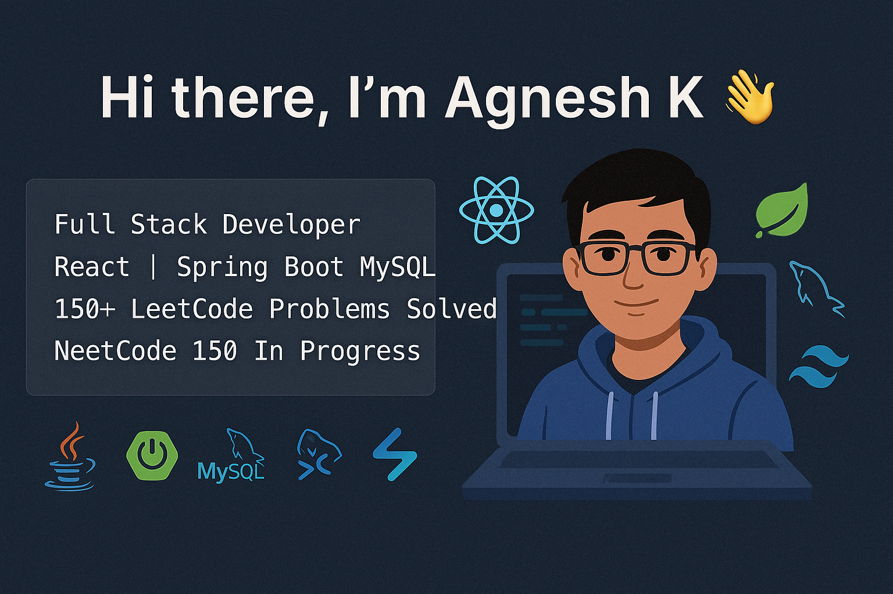

<!-- GitHub Profile README -->

<h1 align="center">Hi there, I'm Agnesh K 👋</h1>

  

<!-- 📸 Updated Banner (Fixed size & centered) -->
<!-- 🎨 Updated Banner (Smaller height, centered, clean display) -->
<!-- 🎨 Responsive Full-Width Banner -->
<!-- 🎨 Clean Full-Width Responsive Banner -->

  

---

### 🧑‍💻 About Me

- 🔭 Full Stack Developer working with **React**, **Spring Boot**, **MySQL**, and **Tailwind CSS**
- 🎯 Currently solving **NeetCode 150** to strengthen DSA  
- ✅ Solved over **150 problems** on **LeetCode**
- 💡 Passionate about clean code, system design & product thinking

---

### ⚙️ Tech Stack

  
  
  
  
  
  
  
  

---

### 📊 GitHub Stats

  
  

---

### 🌐 Connect with Me

  
  
  
  

---

<i>Thanks for visiting my profile! Let’s build something impactful together 🚀</i>

